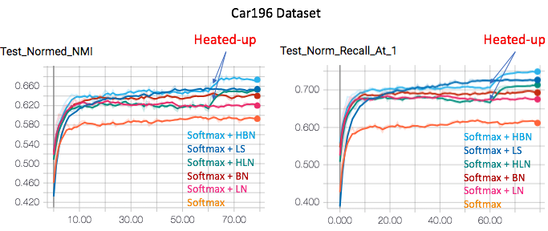
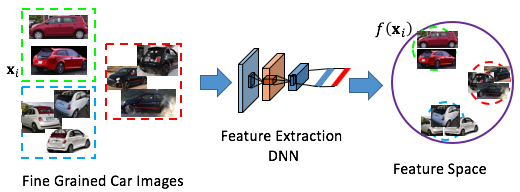
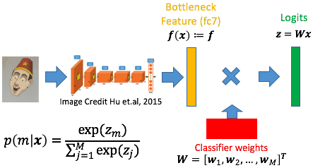
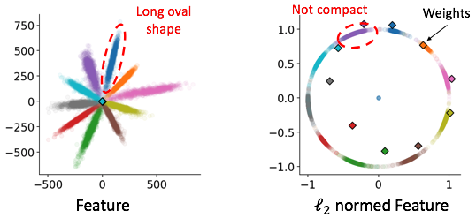
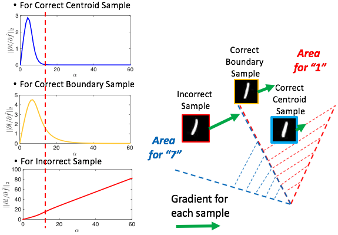
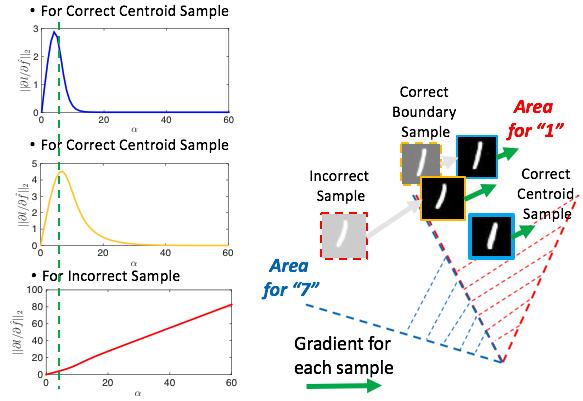

# Heated-Up Softmax Embedding
Project page for [Heated-Up Softmax Embedding](https://arxiv.org/abs/1809.04157). We propose a “heating-up” strategy to train a classifier with increasing temperatures, leading the corresponding embeddings to achieve state-of-the-art performance on a variety of metric learning benchmarks.




## Introduction

Descriptor extraction is mapping an image to a point in the descriptor space.



**A good descriptor should be:**

   * Compact: Samples from the same class to be close
   * Spread-out: Samples from different classes to be far away

Bottleneck feature from classification network shows strong performance in [1]



Bottleneck feature is not learned to be compact and spread-out, thus may not be suitable for clustering and retreival. Here are some features learned from MNIST. Each color shows one digit. The diamond shows classifier weight. 



## Temperature Parameter 𝛼
Applying both ℓ2 normalization to both feature and weight show strong performance in face verification [2,3]. Need temperature parameter 𝛼 for gradient tuning.


Here are some features learned from MNIST with new pipeline. 𝛼 plays an important role in determining the final distribution.


Consider the magnitude of the gradient with respect to descriptor, different 𝛼 values assign different gradients to different samples.


## Heated-Up Feature
At the begining of the training, we need intermediate 𝛼 to assign large gradient to incorrect sample and medium gradient to boundary sample. If 𝛼 is too large (red dash line to the right hand side), boundary sample may not get enough gradient to update, the feature will be not compact. If 𝛼 is too small (red dash line to the left hand side, close to 0), all samples will have similar gradient, training may not be effective (no "hard mining").



At the end of the training, all the samples are correctly classified. We need small 𝛼 to assign large gradient to all the samples to further compress the distribution.




## Requirements
See [./requirements.txt](requirements.txt)

## Run the code

1) Prepare the data. Run codes in ./dataset/ to download and preprocess the data.

```python
python ./dataset/car196.py -h
```

2) Download inception_v1 from [Tensorflow site](http://download.tensorflow.org/models/inception_v1_2016_08_28.tar.gz), and save it in ./data/model/.

3) Check [./tensorflow/run\_Inception.py](tensorflow/run_Inception.py) to see how to run on Car196, Bird200 and Product datasets. 

```python
python ./tensorflow/run_Inception.py
```

4) Check [./tensorflow/run\_mnist\_lenet.py](tensorflow/run_mnist_lenet.py) to see how to run on Mnist dataset to get the distribution map.

```python
python ./tensorflow/run_mnist_lenet.py
```

## Citation

Please cite us if you find this code useful:

```
@inproceedings{zhang2018Heated,
title={Heated-Up Softmax Embedding},
author={Zhang, Xu and Yu, Felix X. and Karaman, Svebor and Zhang, Wei and Chang, Shih-Fu},
booktitle={arXiv preprint arXiv:1809.04157},
year={2018}
}
```
## Reference
[1] Y. Movshovitz-Attias, A. Toshev, T. K. Leung, S. Ioffe, and S. Singh. No Fuss Distance Metric Learning Using Proxies. In ICCV 2017

[2] Wang, Feng, Xiang Xiang, Jian Cheng, and Alan L. Yuille. NormFace: L2 Hypersphere Embedding for Face Verification. In ACM MM 2017

[3] Liu, Weiyang, Yandong Wen, Zhiding Yu, et al. SphereFace: Deep Hypersphere Embedding for Face Recognition. In CVPR 2017
